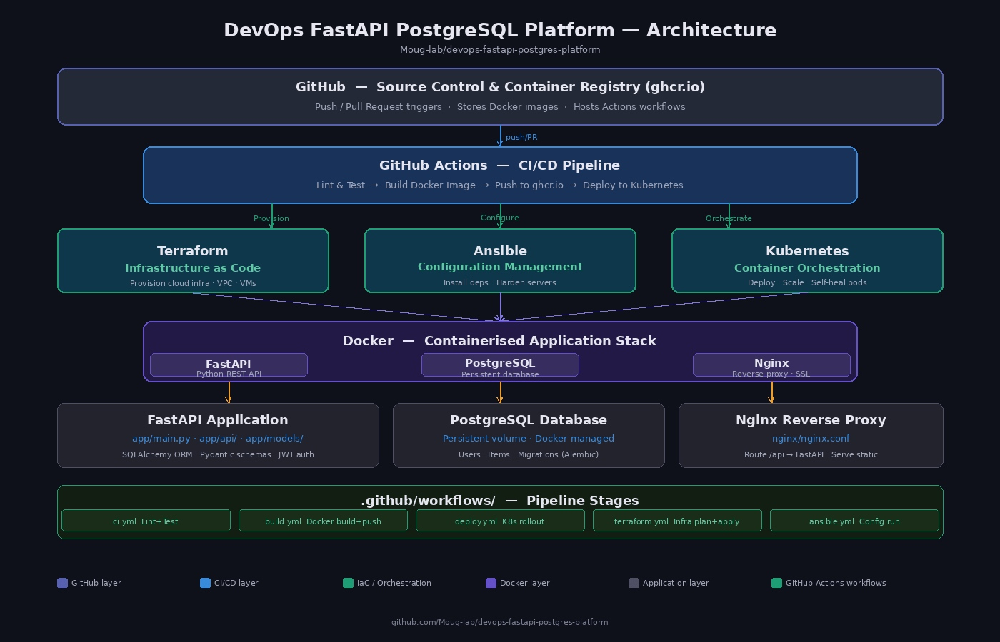

# DevOps FastAPI PostgreSQL Platform



[](https://github.com/Moug-lab/devops-fastapi-postgres-platform/actions/workflows/pipeline.yml)
[](https://www.python.org/)
[](https://fastapi.tiangolo.com/)
[](https://www.docker.com/)
[](https://www.postgresql.org/)
[](https://www.terraform.io/)
[](https://www.ansible.com/)
[](LICENSE)

---

## What Is This Project?

This project is a **complete DevOps platform** built from scratch on a regular Windows laptop.

Think of it like building a small factory:
- The **factory building** = the computer (HP ProBook 6460b running Windows)
- The **machines inside** = software tools like Docker, Python, PostgreSQL
- The **production line** = the automated pipeline that builds, tests, and delivers the software
- The **quality inspector** = Prometheus and Grafana monitoring the system 24/7

Everything in this project is real, working software — not just theory.

---

## Simple Explanation of Every Tool Used

Before diving in, here is a plain-English explanation of every tool and technology used in this project.

### Operating Systems Used

| OS | What It Is | Why We Used It |
|---|---|---|
| Windows 10/11 | The main operating system on the laptop | Where everything starts |
| Ubuntu Linux (via WSL2) | A Linux system running inside Windows | Required for Terraform and Ansible |

> WSL2 means "Windows Subsystem for Linux version 2" — it lets you run Linux commands inside Windows without needing a separate computer.

### Programming and Frameworks

| Tool | Plain English Explanation |
|---|---|
| Python 3.10 | A programming language — like giving instructions to a computer in simple steps |
| FastAPI | A tool that turns Python code into a web API — like a waiter that takes requests and returns answers |
| Uvicorn | The engine that runs FastAPI — like the engine of a car |
| psycopg2 | A bridge between Python and PostgreSQL — like a translator between two people speaking different languages |
| prometheus-client | A tool that counts and reports what is happening inside the API |

### Database

| Tool | Plain English Explanation |
|---|---|
| PostgreSQL 15 | A database — like a very organized digital filing cabinet that stores all data |

### Containers and Packaging

| Tool | Plain English Explanation |
|---|---|
| Docker | Packages software into a box (container) so it runs the same everywhere |
| Docker Compose | Runs multiple Docker boxes together at the same time |
| Dockerfile | A recipe that tells Docker how to build the box |

> Think of Docker like a lunchbox. You pack everything your app needs inside it. No matter whose kitchen you open it in, it looks and tastes exactly the same.

### Infrastructure as Code

| Tool | Plain English Explanation |
|---|---|
| Terraform | Writes instructions to create infrastructure (like networks) automatically instead of clicking buttons manually |

> Instead of going to a cloud website and clicking "Create Network", Terraform does it with code. This means you can recreate the same setup in seconds.

### Configuration Management

| Tool | Plain English Explanation |
|---|---|
| Ansible | Sends commands to servers automatically — like a remote control for computers |

> Instead of logging into a server and typing commands by hand, Ansible does it all at once across many servers.

### Monitoring and Observability

| Tool | Plain English Explanation |
|---|---|
| Prometheus | Collects numbers and statistics from the running app every 5 seconds |
| Grafana | Draws charts and graphs from the data Prometheus collects |

> Prometheus is like a doctor taking your pulse every few seconds. Grafana is the monitor on the wall showing the heartbeat as a graph.

### Automation and CI/CD

| Tool | Plain English Explanation |
|---|---|
| GitHub Actions | Automatically runs tests, builds Docker images, and deploys the app every time code is pushed to GitHub |
| CI/CD | Continuous Integration / Continuous Deployment — the practice of automatically testing and delivering software |

> Think of GitHub Actions like a robot employee. Every time you save your work to GitHub, the robot wakes up, checks everything is correct, packages it, and delivers it — all without you doing anything.

### Version Control

| Tool | Plain English Explanation |
|---|---|
| Git | Tracks every change made to the code — like a time machine for files |
| GitHub | A website that stores Git code and lets teams collaborate |
| GitHub CLI (gh) | Controls GitHub from the command line without opening a browser |

### Developer Tools

| Tool | Plain English Explanation |
|---|---|
| VS Code | A text editor for writing code — like Microsoft Word but for programming |
| PowerShell | The command terminal on Windows — where you type commands |
| WSL2 Ubuntu | Linux terminal running inside Windows |
| Makefile | A shortcuts file — type `make start` instead of a long command |

---

## Project Structure

```
devops-fastapi-postgres-platform/
|
├── app/
│   └── main.py                  # The FastAPI web application code
|
├── docker/
│   └── Dockerfile               # Recipe to build the app container
|
├── monitoring/
│   └── prometheus.yml           # Tells Prometheus what to monitor
|
├── terraform/
│   └── main.tf                  # Creates Docker network automatically
|
├── ansible/
│   └── deploy.yml               # Automates starting all containers
|
├── .github/
│   └── workflows/
│       └── pipeline.yml         # Automated CI/CD pipeline
|
├── architecture.jpg             # Visual diagram of the whole system
├── docker-compose.yml           # Runs all 4 services together
├── requirements.txt             # List of Python packages needed
├── Makefile                     # Shortcut commands
└── README.md                    # This file
```

---

## What The Application Does

This platform runs 4 services at the same time:

| Service | Port | What It Does |
|---|---|---|
| FastAPI | 8000 | Handles API requests from users |
| PostgreSQL | 5432 | Stores all data in a database |
| Prometheus | 9090 | Collects metrics from the API every 5 seconds |
| Grafana | 3000 | Shows beautiful charts of the metrics |

### API Endpoints

| URL | What It Returns |
|---|---|
| `http://localhost:8000/` | Confirms the server is running |
| `http://localhost:8000/db` | Tests the database and returns PostgreSQL version |
| `http://localhost:8000/metrics` | Returns raw metrics data for Prometheus |
| `http://localhost:8000/docs` | Auto-generated API documentation |

---

## How to Run This Project

### What You Need First

- A Windows 10 or 11 computer
- At least 4GB of RAM free
- Internet connection for first-time downloads

### Step 1 — Install the tools

```powershell
# Install Python 3.11.9
Invoke-WebRequest -Uri "https://www.python.org/ftp/python/3.11.9/python-3.11.9-amd64.exe" -OutFile "$env:USERPROFILE\Downloads\python-3.11.9-amd64.exe"
Start-Process -FilePath "$env:USERPROFILE\Downloads\python-3.11.9-amd64.exe" -ArgumentList "/quiet InstallAllUsers=1 PrependPath=1" -Wait

# Install Git
winget install --id Git.Git

# Install GitHub CLI
winget install --id GitHub.cli

# Install VS Code
winget install --id Microsoft.VisualStudioCode

# Install Docker Desktop
Invoke-WebRequest -Uri "https://desktop.docker.com/win/main/amd64/Docker%20Desktop%20Installer.exe" -OutFile "$env:USERPROFILE\Downloads\DockerDesktopInstaller.exe"
Start-Process -FilePath "$env:USERPROFILE\Downloads\DockerDesktopInstaller.exe" -ArgumentList "install --quiet --backend=wsl-2" -Wait
```

### Step 2 — Install Ubuntu via WSL2

```powershell
wsl --install -d Ubuntu
wsl --set-default-version 2
```

### Step 3 — Install Terraform inside Ubuntu

```bash
sudo apt update && sudo apt install wget unzip -y
wget https://releases.hashicorp.com/terraform/1.14.7/terraform_1.14.7_linux_amd64.zip
unzip terraform_1.14.7_linux_amd64.zip
sudo mv terraform /usr/local/bin/
```

### Step 4 — Install Ansible inside Ubuntu

```bash
sudo apt install ansible -y
```

### Step 5 — Clone this repository

```powershell
cd $env:USERPROFILE\Documents
git clone https://github.com/Moug-lab/devops-fastapi-postgres-platform.git
cd devops-fastapi-postgres-platform
```

### Step 6 — Start the platform

```powershell
docker compose up --build
```

That is it. The entire platform starts automatically.

---

## Open in Your Browser

Once running, open these URLs:

| URL | What You Will See |
|---|---|
| http://localhost:8000 | FastAPI running message |
| http://localhost:8000/docs | Full API documentation |
| http://localhost:9090 | Prometheus metrics dashboard |
| http://localhost:3000 | Grafana charts (login: admin / admin) |

---

## Useful Commands

```bash
# Start everything
docker compose up -d

# Stop everything
docker compose down

# See what is running
docker compose ps

# Watch live logs
docker compose logs -f

# Rebuild after code changes
docker compose up --build

# Run Ansible deployment
ansible-playbook ansible/deploy.yml

# Terraform — create infrastructure
cd terraform
terraform init
terraform apply

# Push code to GitHub
git add .
git commit -m "your message"
git push origin main
```

---

## How the CI/CD Pipeline Works

Every time code is pushed to GitHub, this happens automatically:

```
1. GitHub detects the push
        |
        v
2. GitHub Actions wakes up
        |
        v
3. Sets up Python 3.10 environment
        |
        v
4. Installs all requirements
        |
        v
5. Runs tests
        |
        v
6. Builds Docker image
        |
        v
7. Pushes image to GitHub Container Registry (ghcr.io)
        |
        v
8. Deployment step completes
```

No manual work needed. Everything is automated.

---

## Environment and Hardware Used

| Item | Details |
|---|---|
| Laptop | HP ProBook 6460b |
| Main OS | Windows 10/11 64-bit |
| Linux OS | Ubuntu (via WSL2) |
| Python | 3.10 (inside Docker), 3.11.9 (on Windows) |
| Git | 2.53.0 |
| Docker Desktop | Latest stable |
| Terraform | 1.14.7 |
| Ansible | Latest via apt |
| VS Code | Latest stable |

---

## Author

**Moug-lab**
GitHub: [github.com/Moug-lab](https://github.com/Moug-lab)

---

## License

This project is open source and available under the MIT License.
